Graduation Project Flutter App
Welcome to the Graduation Project — a comprehensive Flutter application showcasing advanced techniques, clean architecture, and real backend integration.
This project is designed as a real-world mobile app with multi-platform support, using Cubit/BLoC, Firebase, Hive, and many other production-ready tools.

Table of Contents
Introduction

Features

Getting Started

Project Structure

Core Services & Architecture

Feature Details

Authentication

Community & Posts

Mood Tracker

Habits

Books & Podcasts

Profile

Testing

Chatbot

Firebase Integration

Assets

Platform Support

Dependency Injection

Dependencies

Contributing

License

Further Resources

Introduction
The Graduation Project app is a feature-rich, production-grade Flutter application built with clean architecture principles, modular code organization, and strong separation of concerns.
It connects to a custom backend API as well as Firebase services for authentication, storage, and messaging.

Features
Authentication: Sign up, login, password reset, logout

Community: Posts, comments, reactions, and voting system

Mood Tracker: Log moods, write notes, view statistics

Habit Tracker: Manage habits, timers, and a yoga stopwatch

Books & Podcasts: Browse media content with playback and PDF viewing

Profile: Edit and view personal data

Testing/Quizzes: Interactive quizzes with results storage

Chatbot: Real-time chat experience

Offline Handling: Assets for no-internet and empty states

Multi-Platform: Android, iOS, Windows, Linux

Firebase Integration: Auth, Firestore, Storage, Messaging

Getting Started
Clone the repository

sh
Copy
Edit
git clone https://github.com/FADFADLY/flutter.git
cd flutter
Install Flutter SDK
Official Flutter Installation Guide

Install dependencies

sh
Copy
Edit
flutter pub get
Configure Firebase

Update lib/firebase_options.dart with your Firebase project keys.

Follow FlutterFire setup guide.

Run the app

Mobile:

sh
Copy
Edit
flutter run
Desktop:

sh
Copy
Edit
flutter run -d windows
flutter run -d linux
Project Structure
text
Copy
Edit
lib/
  core/
    services/
      remote/              # API services
      networking/          # HTTP client & interceptors
      get_it_services.dart # Dependency Injection
    errors/                # Exception handling
  features/
    auth/                  # Authentication module
    community/             # Posts, comments, votes
    mood_tracker/          # Mood logging
    habits/                # Habit tracker
    books/                 # Books module
    podcasts/              # Podcasts module
    profile/               # User profile
    test/                  # Quizzes/tests
    chatbot/               # Chatbot
  generated/               # Generated files (assets, localization)
assets/                    # Images, audio, JSON states
windows/                   # Windows-specific code
linux/                     # Linux-specific code
Core Services & Architecture
Clean Architecture with clear separation between data, domain, and presentation layers.

Cubit/BLoC for state management.

Repository Pattern for business logic abstraction.

Secure Storage for sensitive data using flutter_secure_storage.

Offline Support via Hive for local caching.

Feature Details
Authentication
Registration, Login, Password Reset

Token storage in secure storage

Cubit states for each flow

Community & Posts
Create, update, delete posts

Commenting system

Voting and reaction features

Mood Tracker
Track daily moods with notes

View mood statistics and history

Habits
Create and manage habits

Timers and yoga stopwatch

Books & Podcasts
View and read books (PDF)

Listen to podcasts with waveform animations

Profile
Update personal details

Fetch and display profile info

Testing
Quizzes with calculated results

Store test history

Chatbot
Real-time chat interaction

Offline chat history using Hive

Firebase Integration
Auth for login/signup

Cloud Firestore for data storage

Cloud Messaging for push notifications

Firebase Storage for files and images

Assets
Managed through lib/generated/assets.dart

Images, icons, SVGs, Lottie animations, and JSON empty states

Organized into subfolders (images/, audio/, tests/, etc.)

Platform Support
Mobile: Android & iOS

Desktop: Windows & Linux

Adaptive UI using flutter_screenutil and device_preview

Dependency Injection
get_it used for service and repository registration

Centralized setup in get_it_services.dart

Dependencies
Package	Purpose
flutter_bloc	State management
get_it	Dependency Injection
firebase_core, firebase_auth, cloud_firestore	Firebase integration
hive, hive_flutter, hive_generator	Local storage
flutter_secure_storage	Secure token storage
cached_network_image	Optimized image loading
flutter_native_splash	Custom splash screens
flutter_launcher_icons	App icon generation
file_picker, image_picker	File & image selection
audioplayers, just_audio, audio_waveforms	Audio playback
fl_chart	Charts for statistics
table_calendar	Calendar-based UI
lottie	Lottie animations
shimmer, skeletonizer	Loading placeholders
modal_progress_hud_nsn	Progress HUD overlays
persistent_bottom_nav_bar	Bottom navigation
pull_to_refresh, custom_refresh_indicator	Pull-to-refresh functionality
permission_handler	App permissions
vibration	Device vibration control
intl, intl_utils	Internationalization
dartz	Functional programming utilities

Contributing
Fork & clone the repository.

Create your feature branch (git checkout -b feature/AmazingFeature).

Commit changes (git commit -m 'Add AmazingFeature').

Push to your branch (git push origin feature/AmazingFeature).

Open a Pull Request.

License
This project is licensed under the MIT License — see the LICENSE file for details.

Further Resources
Flutter Documentation

FlutterFire Documentation

BLoC Documentation

---

## 📸 Screenshots

Below are actual screenshots from the app showing various features and UI states:

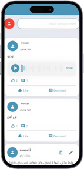
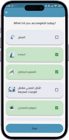
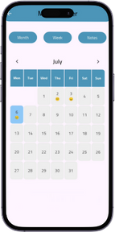

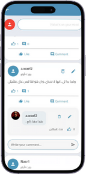

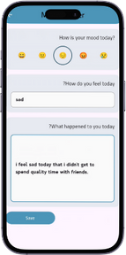
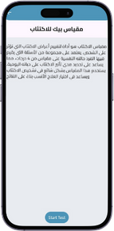
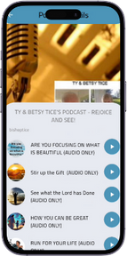
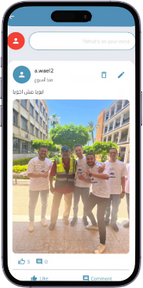
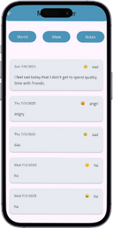
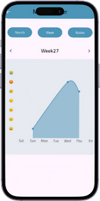

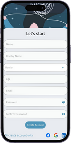

> Explore the screenshots above to get a real sense of the app's capabilities, visual polish, and platform-adaptive UI!

---

For further questions, feature requests, or suggestions, feel free to open an issue or discussion!
